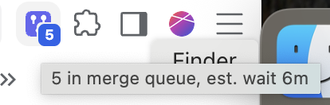

# Merge Queue Badge

A Chromium extension (Brave, Chrome, Edge) that shows the number of pull requests in a GitHub [merge queue](https://docs.github.com/en/repositories/configuring-branches-and-merges-in-your-repository/configuring-pull-request-merges/managing-a-merge-queue) on the toolbar button. It refreshes every minute, and clicking the button opens the queue page.



## What you see

| Badge | Meaning |
| --- | --- |
| Green `0` | The queue is empty. |
| Blue `N` | `N` items in the queue, within limits. |
| Red `N` | More than 15 items, or an estimated wait of more than 10 minutes. Both limits are configurable. |
| Gray `?` | No token or queue URL set yet. |
| Gray `!` | The token is invalid or lacks access, or GitHub couldn't be reached. |
| Gray `–` | That branch has no merge queue. |

Hover the button for details, such as `3 in merge queue, est. wait 5m`. Right-click it and choose **Refresh now** to update immediately instead of waiting for the next minute.

The wait is the largest GitHub-estimated time to merge among queued entries (what a PR joining now would wait), falling back to the age of the oldest entry. If the token can't read pull requests, the wait is left out and the tooltip says why.

## Install

1. Open `brave://extensions` (or `chrome://extensions`) and turn on **Developer mode**.
2. Click **Load unpacked** and select this folder.
3. The options page opens on first install. Paste your queue URL, which looks like `https://github.com/<owner>/<repo>/queue/<branch>`, and a token (see below). Press **Test**, then **Save**.
4. Pin the extension to the toolbar. You can reopen the options by right-clicking the button and choosing **Options**.

## Getting a token

The extension reads the queue through the GitHub GraphQL API, which can't use your browser login, so it needs a token. The token is stored in `chrome.storage.local` (not synced) and is only sent to `https://api.github.com/graphql`. It needs **read-only** access to pull requests on the repository that owns the queue.

### Option 1: GitHub CLI (quickest)

```sh
gh auth login      # if you aren't logged in yet
gh auth token      # prints a token; paste it into the options page
```

The CLI token already has the `repo` scope and is SSO-authorized for your organizations.

### Option 2: fine-grained token

The options page has a link that opens GitHub's token form with the permissions already filled in and your queue's owner (organization or user) preselected. You can also build the link yourself:

```
https://github.com/settings/personal-access-tokens/new?name=Merge+Queue+Badge&expires_in=90&pull_requests=read&contents=read&metadata=read&target_name=<owner>
```

GitHub can't prefill the repository, so on that page:

1. Under **Repository access**, choose **Only select repositories** and pick the repository that owns the queue.
2. Click **Generate token** and paste it into the options page.

Organizations can restrict fine-grained tokens or require an admin to approve them. If your token stays "pending" or the org isn't offered as an owner, use option 1 or 3.

### Option 3: classic token

[Create a classic token](https://github.com/settings/tokens/new?scopes=repo&description=Merge%20Queue%20Badge) with the `repo` scope. For organizations that use SSO, click **Configure SSO** next to the token and authorize it.

### Troubleshooting

- **Count shows but no wait time**: the token can't read the individual queue entries. Make sure **Pull requests: Read** is granted (the **Test** button on the options page warns about this).
- **Gray `!`**: the token is wrong, expired, or not authorized for the organization (SSO or admin approval).
- **Gray `–`**: the URL points at a branch with no merge queue.

## Options

- **Merge queue URL**: any `https://github.com/<owner>/<repo>/queue/<branch>`.
- **Red thresholds**: item count (default 15) and wait in minutes (default 10).

## Development

```sh
npm test    # unit tests for queue.js (URL parsing, token link, summary, colors, API error handling)
```

The extension has no build step. After editing, press the reload icon on the extension's card in `brave://extensions`.

## License

MIT
